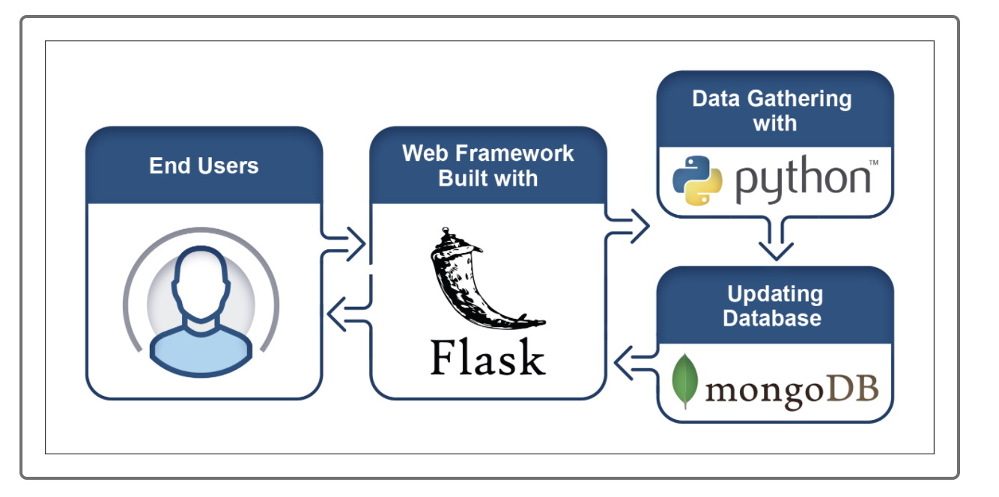
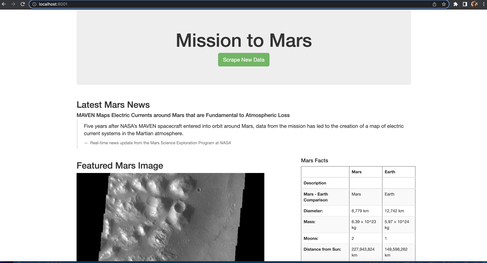
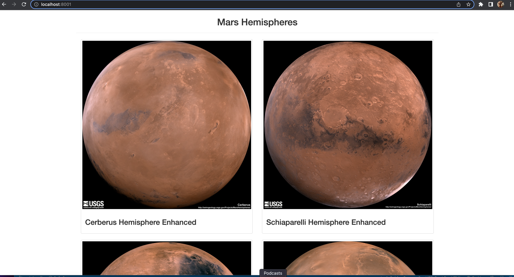

# Mission to Mars

### Summary

Robin, a data analyst with astronomy as a hobby, approached us to help build a we application called **Mission to Mars**. The goal was to create a web application with a basic design, that would contain a button that would refresh the page with Real-time news scraped from the live website of the **Mars Science Exploration Program** at **NASA**. 

### Execution

- Using **BeautifulSoup** and **Splinter** on **Jupyter Notebook** using **Python** language, we automated a web browser that performed a web scrape, visiting different websites that contained data about the Mission to Mars. 
- Using **MongoDB** we stored our data it in a NoSQL database.
- We rendered the data in a web application created with **Flask** to display the data from the web scrape.
- With **Python** and **HTML**, using **JavaScript** language, and adding **Bootstrap** components, we created the building blocks for the web application.
- Bridging **Mongo** and **Flask**, we were able to make the web application available in a browser, with an interactive button.

The following diagram illustrates the process visually:

### Results

The screenshots below show our web application, where the`Scrape New Data` button refreshes a real-time update of web scrapes from the Mars Science Exploration Program and the Astropedia Lunar and Planetary Cartographic Catalog websites from NASA; with news articles, Mars facts, real-time images of its surface, and breath-taking photographic views of its four hemispheres:

